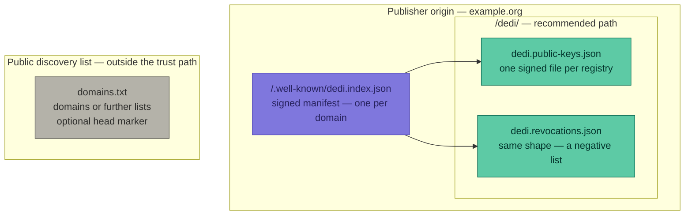

# Decentralized Directory (DeDi): Enhancing Trust in Digital Transactions

DeDi is an open protocol for publishing public directories — public key directories, revocation and
sanctions lists, membership rolls, professional and company registers — so that any party can discover
them and verify what they say. Today each such directory sits behind its own bespoke interface:
relying parties integrate source by source, information goes stale, and every check costs time and
money. DeDi replaces this with one machine-readable convention for publishing directories and one
interface for reading them, so any directory can be evaluated against the three pillars of trust —
integrity, validity, and authenticity (see [docs/trust-pillars.md](docs/trust-pillars.md)).

DeDi's information architecture is organized around three key constructs:

- **Namespace:** Corresponds to an organization (and implicitly to a domain name) as a starting point for trust.
- **Directory:** Refers to a list of records with configurable schemas.
- **Records:** The actual values or pointers to information.

> Important Note: The Decentralized Directory Protocol is not a software product or a rigid implementation manual—it is an open standard designed to enable trust in digital transactions by providing a universal, interoperable foundation for accessing and verifying public information.

## Adopting DeDi

A publisher adopts DeDi by publishing signed DeDi files. There is no further requirement. The
publisher produces one self-contained, signed DeDi file per directory and serves a signed
`/.well-known/dedi.index.json` manifest declaring its signing key. No infrastructure need be
operated: any organization with a domain and a signing key can comply. See
**[docs/publishing-dedi-files.md](docs/publishing-dedi-files.md)** and the **[examples/](examples/)**.

A published directory looks like this:

Only the manifest's path is fixed, per RFC 8615. The `dedi.<name>.json` filename and the `/dedi/`
directory are recommended conventions: the manifest lists each file's absolute URL, so files may be
hosted anywhere the publisher controls — its own website, a source repository, a public file-sharing
service — or deposited with a DeDi server, such as dedi.global, that hosts them on the publisher's
behalf. The choice of host does not affect verification: a verifier evaluates the publisher's
signature against the key declared at the publisher's well-known, irrespective of which party serves
the file.

## DeDi Indexing and Discovery Servers

A DeDi indexing and discovery server is a distinct role is an optional infrastructure
operated by any party that wishes to serve published files at scale: it discovers and verifies
published DeDi files, indexes them, and exposes the DeDi API — `/dedi/lookup` and `/dedi/query` —
across many publishers, adding what static files alone do not provide, such as cross-directory
search, version history, and availability guarantees. A server relays the publisher's original
signature unaltered and does not substitute its own, so a relying party obtains an equivalent
cryptographic guarantee whether it queries a server or retrieves the file directly from the
publisher. Servers are caches and indexes; they are not authorities.

## Use Cases

DeDi standardizes only *how* a public directory is discovered and verified, so the same protocol covers a wide range of trust problems. The canonical patterns include:

- **Public key directories** — discover an issuer's current signing key (and its rotation history) to verify signatures.
- **Revocation & negative lists** — check whether a credential or entity has been revoked, suspended, sanctioned, or blacklisted.
- **Membership & affiliation** — confirm a party is a genuine, in-good-standing member of an association, consortium, or network.
- **Policy & rule registries** — publish machine-readable rules (e.g. data-residency requirements) that platforms can auto-apply.
- **AI agent registries** — give autonomous agents a discoverable, verifiable, revocable identity bound to an accountable operator.

These patterns share one interface, so they compose — a membership record can point at a key directory, an agent authenticates against its registered key, and a revocation list gates them all. See **[docs/use-cases.md](docs/use-cases.md)** for the full walkthroughs and **[schemas/](schemas/)** for ready-to-use reference schemas.

## dedi.global – a free to use discovery and publishing infrastructure

For registrars who would rather not host and manage files themselves, a ready-to-use hosted server – https://dedi.global/ is offered by the Network for Humanity Foundation. This philanthropic initiative allows registrars to effortlessly publish and manage their directories on a robust decentralized infrastructure, complementing and fully aligned with the open DeDi protocol. DeDi supports the co-existence of multiple data standards and schemas (e.g., VC JSON-LD, mDocs/mDL). More resources and API tools can be found [here](https://dedi-global.gitbook.io/docs).

## Get Started

- **Publish your first directory.** No infrastructure is required: sign a DeDi file, host it on an endpoint you already control, and serve a `/.well-known/dedi.index.json`. Begin with **[docs/publishing-dedi-files.md](docs/publishing-dedi-files.md)** and the **[examples/](examples/)**.
- **If you would rather not host the files yourself**, claim your namespace on https://dedi.global/ and publish your directory there.
- **Adopt the DeDi Protocol** to look up and query public records in your verification flows, against any publisher's files or any DeDi server.
- **If you already operate a public registry**, publish its contents as signed DeDi files alongside it — no change to your existing systems is required.

Let's co-create a future where trust is seamlessly integrated into every digital transaction.
