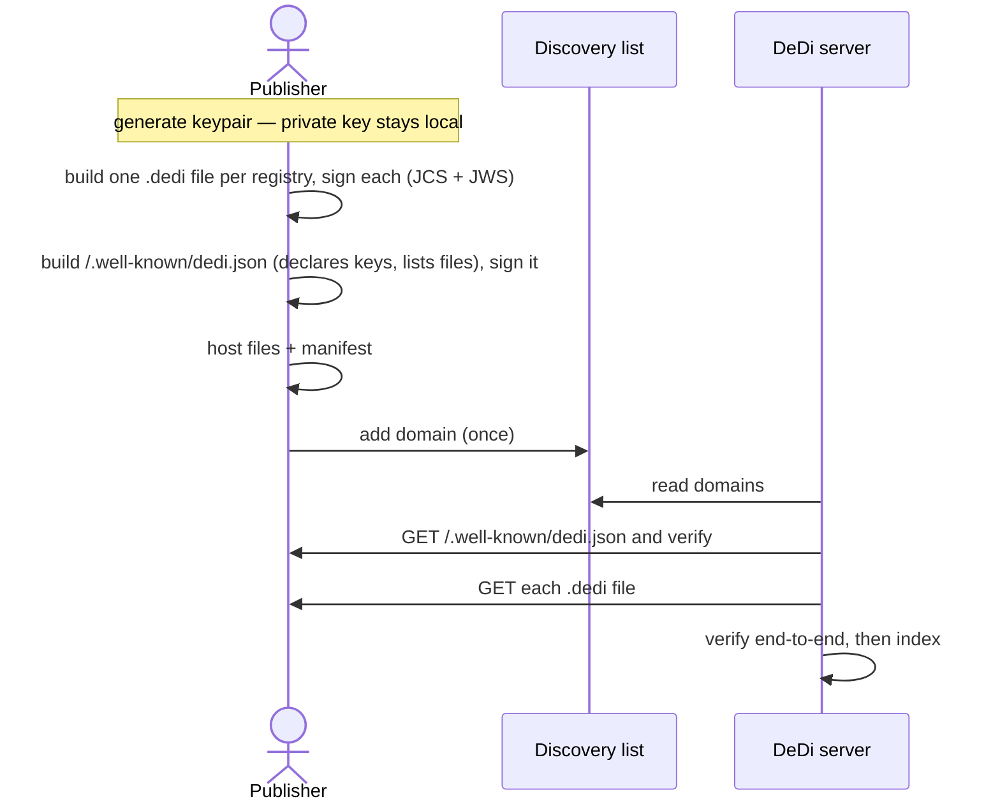
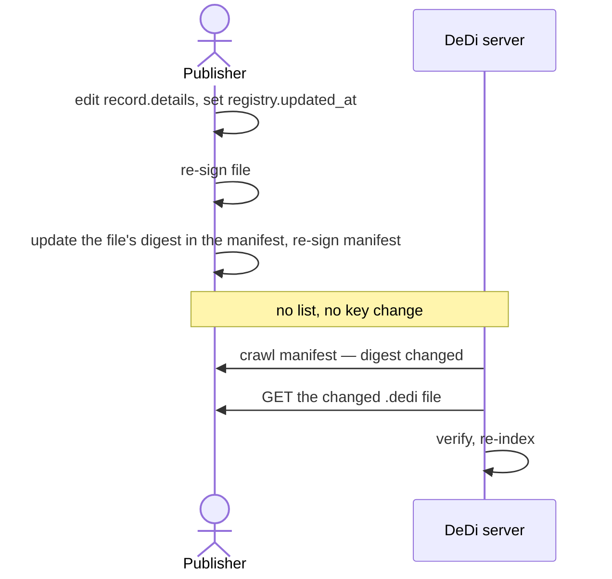
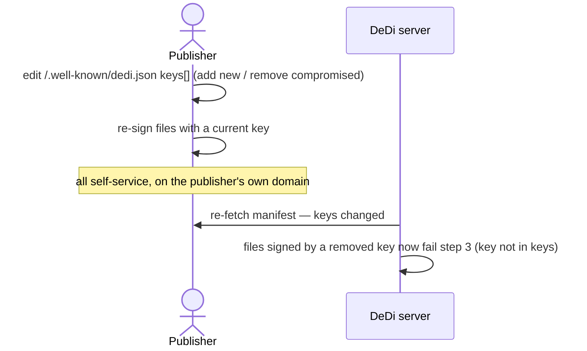
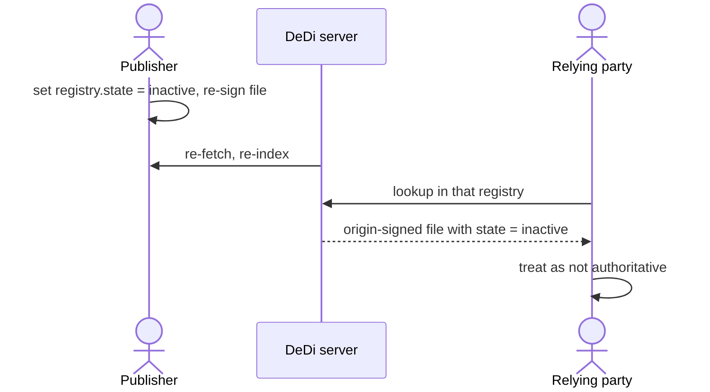
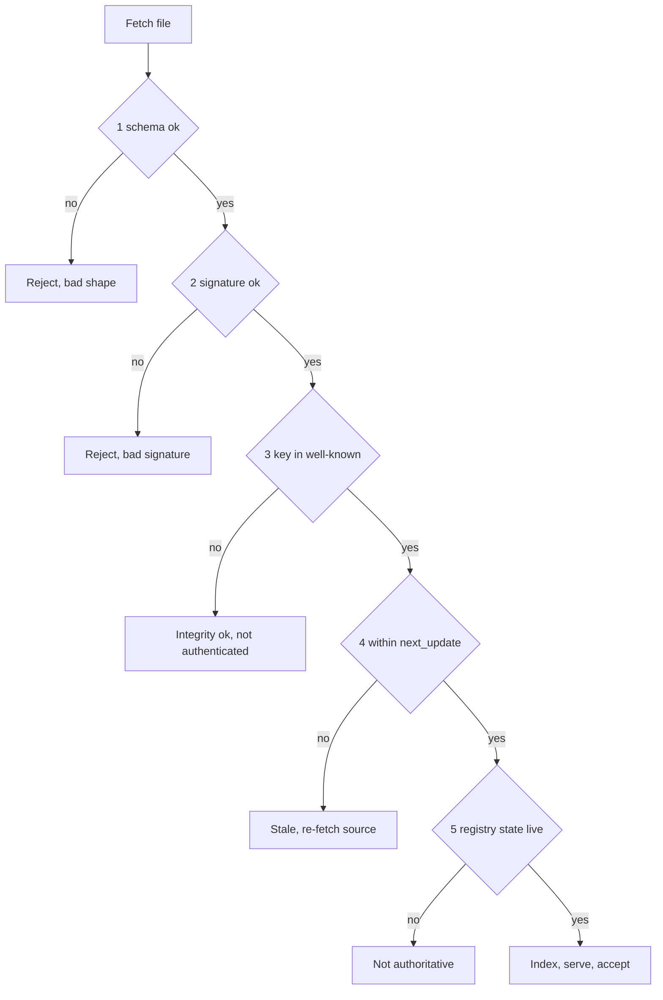
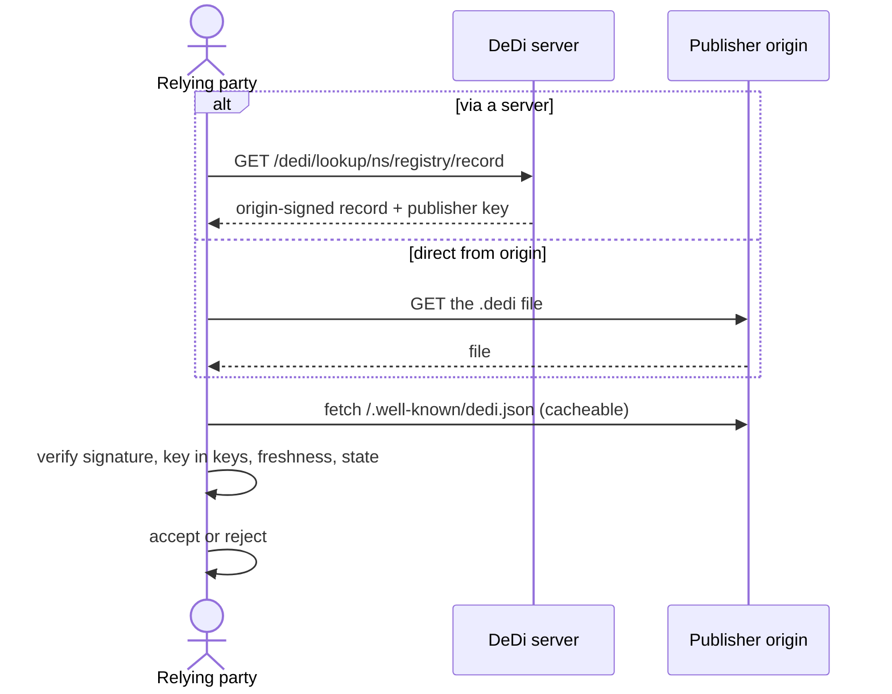

# Publishing DeDi Files

*Origin-hosted, server-optional directories*

Status: **Draft** · Target: `docs/publishing-dedi-files.md` in the DeDi Protocol repo

---

## 1. Principle

**"Build on DeDi" means "publish DeDi files" — not "stand up a DeDi API endpoint."**

Contributing data to the decentralized directory should not require running a server. A **publisher**
produces one or more self-contained, signed **`.dedi` files** and hosts them wherever it already manages
content — its own website, a GitHub repo, a public drive. It never runs anything. **DeDi servers**
discover those files, verify them, index them, and answer queries on the publisher's behalf — always
relaying the **publisher's own signature** so any client verifies the data end-to-end.

Trust is one sentence: **verify a file's own signature, then confirm its key is the one the publisher
declares at its domain's well-known.** No central authority sits in that path.

| | **Publisher** | **DeDi server** |
|---|---|---|
| Produces | `.dedi` files + a signed manifest | an index + query API |
| Signs data | **yes** (mandatory) | no — relays publisher signatures |
| Runs infrastructure | **no** | yes |
| Trust role | source of truth | untrusted cache · index |

---

## 2. Terminology

- **Publisher** — owns the data, produces `.dedi` files. Identified by a domain it controls.
- **`.dedi` file** — a self-contained, signed JSON document: one registry (directory) and its records. §5.
- **Manifest** — `/.well-known/dedi.json`, a signed document declaring the publisher's current signing
  key(s) and listing its `.dedi` files. **The authority.** §6.
- **DeDi server** — ingests `.dedi` files, verifies them, indexes them, serves the DeDi query API. §8.
- **Discovery list** — a public list of publisher domains, so servers know who exists. Vouches for
  nobody; not in the trust path. §11.

The DeDi information model is unchanged: **Namespace → Registry → Record.** A `.dedi` file is a signed,
transport-independent projection of one Registry and its Records.

---

## 3. Roles and the end-to-end flow

```
   PUBLISHER (example.org)
     │  produces + signs two things:  .dedi files   and   /.well-known/dedi.json (declares its keys)
     │  hosts both anywhere it controls;  puts its domain on a public discovery list
     ▼
   DEDI SERVER (untrusted)   ── finds publishers via the discovery list + crawl
     │  ingests each file, verifies it, indexes, serves /dedi/lookup · /dedi/query
     ▼
   RELYING PARTY
     verify the file's own signature  →  confirm its key ∈ the publisher's well-known  →  trust
     (may query a server, or fetch the .dedi file straight from the publisher — same check either way)
```

Whether a relying party goes through a server or straight to the origin, trust rests on the **publisher's
signature verified against the key in its own signed well-known** — never on the server.

---

## 4. The three artifacts

| Artifact | Where | Job |
|---|---|---|
| **`.dedi` file** | anywhere the publisher controls | one signed registry + its records (§5) |
| **Manifest** `/.well-known/dedi.json` | the publisher's domain | declares current key(s); lists files — **the authority** (§6) |
| **Discovery list** | a public list (e.g. a GitHub repo) | names publisher domains so servers find them (§11) |

Everything the *trust* depends on is in the first two, both signed. The third is a phone book.

---

## 5. The `.dedi` file

A `.dedi` file carries **exactly one registry** (directory). A namespace with *N* registries publishes
*N* files, indexed together by the manifest. Fields reuse the DeDi API's names so a server projects a
file into a `/dedi/lookup` response without translation.

```jsonc
{
  "dedi_version": "0.1",
  "type": "dedi-file",                        // optional — the extension/path already disambiguates
  "source_url": "https://example.org/dedi/public-keys.dedi",  // where to re-fetch a fresher copy after relocation
  "next_update": "2026-07-15T10:00:00Z",      // stale after this → re-fetch source_url (§9)

  "publisher": {
    "domain": "example.org",                  // its well-known MUST list the key below
    "key": {                                  // PUBLIC key only, RFC 7517 JWK. Embedded → offline integrity.
      "kid": "key-1", "kty": "OKP", "crv": "Ed25519",
      "x": "11qYAYKxCrfVS_7TyWQHOg7hcvPapiMlrwIaaPcHURo"
    }
  },

  "namespace": "example.org",                 // → {namespace} in /dedi/lookup (usually the domain)
  "registry": {
    "name": "public-keys",                    // → {registry_name}
    "schema": "https://raw.githubusercontent.com/LF-Decentralized-Trust-labs/decentralized-directory-protocol/main/schemas/public_key.json",
    "state": "live",                          // live | inactive
    "updated_at": "2026-07-08T10:00:00Z"      // content last changed (see §9 for updated_at vs next_update)
  },

  "records": [                                // pure list entries — a name + schema-conformant data
    {
      "record_name": "auth-service",          // → {record_name}
      "details": {
        "public_key_id": "example.org:auth",
        "publicKey": "MCowBQYDK2VwAyEAGb9ECWmEzf6FQbrBZ9w7lshQhqowtrbLDFw4rXAxZk",
        "keyType": "ed25519",
        "keyFormat": "base64",
        "entity": { "name": "Auth Service", "url": "https://example.org/auth" }
      }
    }
  ],

  "proof": {                                  // detached JWS over JCS(document − proof), by publisher.key
    "verification_method": "key-1",           // MUST reference publisher.key.kid
    "canonicalization": "JCS",                // RFC 8785
    "jws": "eyJhbGciOiJFZERTQSIsImI2NCI6ZmFsc2UsImNyaXQiOlsiYjY0Il19..<detached-signature>"
  }
}
```

### 5.1 Field notes

- **`source_url`** is the one link a relocated copy keeps back to origin, for re-fetching a fresher version.
- **`publisher.key` is public only.** Publishers sign locally; no server ever receives private key material.
- **`records` are pure data** — `{ record_name, details }`. Lifecycle lives at the *registry* level
  (`state`) and via *negative registries*, not per record (§9).
- **`schema`** is a URL or an inline JSON Schema object (§10) — never anchored to a single central host.
- One file = one registry. Splitting a very large registry across multiple files (sharding) is a
  deferred extension (§14), not part of this version.

---

## 6. The manifest — `/.well-known/dedi.json`

The manifest is **the authority**: it declares the publisher's current signing key(s) and lists its
files. It is signed, and served under the domain's TLS at the well-known path (RFC 8615).

```jsonc
{
  "dedi_version": "0.1",
  "type": "dedi-manifest",                    // optional
  "domain": "example.org",                    // self-identifies a relayed copy; verify checks served host == this
  "name": "Example Org Trust Services",       // optional

  "keys": [                                   // ← THE AUTHORITY. current signing key(s); presence = valid.
    { "kid": "key-1", "kty": "OKP", "crv": "Ed25519", "x": "11qYAYKxCrfVS_7TyWQHOg7hcvPapiMlrwIaaPcHURo" }
  ],

  "updated_at": "2026-07-01T09:00:00Z",       // keys / file-list last changed (moving = a key rotated, or a registry added/removed)
  "next_update": "2026-07-15T10:00:00Z",      // how long a verifier may cache these keys (revocation bound)

  "files": [                                  // the registries offered — discovery + change-detection
    { "registry": "public-keys", "url": "https://example.org/dedi/public-keys.dedi",
      "digest": "sha-256:9f2c1d4e7a8b0c3d5e6f70819293a4b5c6d7e8f90a1b2c3d4e5f60718293aebae",
      "schema": "https://raw.githubusercontent.com/LF-Decentralized-Trust-labs/decentralized-directory-protocol/main/schemas/public_key.json" },
    { "registry": "revocations", "url": "https://cdn.example.net/revocations.dedi",   // files can live anywhere
      "digest": "sha-256:5b1a2c3d4e5f60718293a4b5c6d7e8f90a1b2c3d4e5f60718293a4b5c6d7e8f0",
      "schema": "https://raw.githubusercontent.com/LF-Decentralized-Trust-labs/decentralized-directory-protocol/main/schemas/revoke.json" }
  ],

  "proof": {                                  // signed by one of `keys`; same rules as §7
    "verification_method": "key-1", "canonicalization": "JCS", "jws": "eyJ..."
  }
}
```

### 6.1 Why self-signing isn't circular

The manifest declares `key-1` and is signed by `key-1`. The anchor that breaks the loop is that it is
served under **TLS at the domain's well-known path** — that is what says "example.org vouches for these
keys," exactly as `did:web` resolves a key from `https://domain/.well-known/did.json`. The signature then
keeps the manifest tamper-evident once it is cached or relayed off the origin.

### 6.2 Key lifecycle lives here

- **Rotate** — add the new key to `keys` (and drop the old when done).
- **Revoke** — remove the key from `keys`. Files signed by it immediately fail verification everywhere,
  because step 3 of §7.3 (embedded key ∈ `keys`) no longer holds.

There is no separate revocation registry for *keys*: presence in `keys` **is** validity. A publisher
manages its entire key lifecycle by editing its own well-known.

### 6.3 `files[].digest`

The whole-file digest lets the *signed* manifest vouch for each `.dedi` file before it is fetched, and
lets a server detect a change (digest moved → re-fetch). It is the only place a whole-file hash is needed;
the file's own signature secures its internal integrity.

---

## 7. Signing and verification

Signing is **mandatory**. Both artifacts are signed the same way.

### 7.1 Canonicalization

The signing input is the whole JSON document **with the `proof` block removed**, canonicalized with
**JCS (RFC 8785)**, so re-serialization (pretty-printing, key reordering) never breaks the signature.
`proof.canonicalization` **MUST** be `"JCS"`.

### 7.2 Signature

`proof.jws` is a **detached JWS (RFC 7515)** over the canonicalized bytes, algorithm matching the key
(e.g. `EdDSA` for `Ed25519`). `proof.verification_method` **MUST** name the signing key's `kid`.

### 7.3 Verification — 5 steps, one network fetch

A verifier (server or relying party) **MUST**, in order:

1. **Shape-check** the file against its schema (§10).
2. **Integrity (offline)** — canonicalize (JCS) the document minus `proof` and verify `proof.jws` against
   the file's **embedded** `publisher.key`. Reject on failure.
3. **Authenticity (one cacheable fetch)** — fetch `https://{publisher.domain}/.well-known/dedi.json`,
   verify *its* signature (step 2, against a key it itself lists), and confirm the file's `publisher.key`
   is present in the manifest's `keys`.
   - Not present → the file is **integrity-valid but not authenticated**. A verifier **MUST NOT** treat it
     as an authentic statement by `publisher.domain`.
4. **Freshness** — `now ≤ next_update` for both file and manifest; past it, re-fetch before relying (§9).
5. **Registry state** — `registry.state == "live"`; an `inactive` registry is not authoritative.

Steps 1–2 are location-independent. Only step 3 touches the network, and its result (the current `keys`)
is cacheable within the manifest's `next_update`.

---

## 8. Discovery

Two complementary mechanisms:

1. **Discovery list (§11)** — the publisher's domain is on a public list; servers watch it and crawl the
   listed domains. Reliable; doesn't depend on anyone linking to the files.
2. **Crawl** — a server reaching any domain fetches `/.well-known/dedi.json`, verifies it, and learns every
   `.dedi` file the publisher offers plus the key to expect. The `.dedi` extension aids opportunistic
   discovery of linked files, but the manifest is the anchor — the web cannot enumerate files by
   extension, only follow links.

---

## 9. Freshness, registry state, and negative lists

A signed file is a **snapshot**: the signature proves *who* and *unmodified-since*, never *still-current*.

- **`next_update`** — every file and manifest carries it. Past it, treat the copy as stale and re-fetch.
  A publisher whose data is stable still re-issues on a cadence, so "silence" differs from "unreachable."
- **`updated_at` vs `next_update`** — `updated_at` moves only when content actually changes; `next_update`
  moves on every re-issue (including a no-op refresh). So a revocation list re-published hourly for
  freshness shows a moving `next_update` but a static `updated_at` — the signal that nothing changed.
- **Registry `state`** — `live` or `inactive`. `inactive` retires a whole directory; a cached copy still
  carries the signal, which "removed from the manifest" alone would not reach.
- **Removing an entry / negatives** — records carry no per-record state. Polarity lives at the registry:
  - a **positive directory** (keys, memberships): presence = valid; remove the entry and freshness
    propagates it;
  - a **negative list** (revocations): presence = revoked — the record's existence *is* the fact.
  - To hard-revoke a member of a positive directory, use the PKI pattern DeDi already supports: remove it
    from the positive registry **and** add it to a companion negative registry. Membership by presence,
    polarity by registry — no per-record lifecycle field required.

---

## 10. Schemas

A registry's `schema` is **either a URL or an inline JSON Schema object** — never anchored to a single
central host (no `dedi.global` URLs). Three practical forms:

```jsonc
"schema": "https://raw.githubusercontent.com/LF-Decentralized-Trust-labs/decentralized-directory-protocol/main/schemas/public_key.json"  // a protocol-declared schema
"schema": "https://example.org/schemas/my_registry.json"  // any external URL the publisher controls
"schema": { "type": "object", "required": ["id"], "properties": { "id": { "type": "string" } } }  // inline — fully self-contained
```

The protocol **declares a small canonical set** in this repo's `schemas/` directory — `public_key`,
`revoke`, `membership` — which a `.dedi` file references by its raw URL. Everyone else uses an external
URL or inlines their own.

> **Temporary — pin before release.** The canonical URLs above point at the `main` branch
> (`.../main/schemas/...`), which is **mutable**: editing a schema on `main` would silently change the
> meaning of every `.dedi` file that references it. Before this spec is released, these MUST be pinned to
> an immutable ref — a version tag or commit SHA, e.g.
> `.../decentralized-directory-protocol/v0.1/schemas/public_key.json`. `main` is a draft placeholder only.

Each canonical schema's own `$id` is set to its raw repo URL (not `dedi.global`), so a schema's identity
and its location agree.

---

## 11. The discovery list

The "registry" is a public list of publisher **domains** — nothing more.

```
dedi-discovery/            (a public GitHub repo, or any public list)
└── domains.txt
       example.org
       univ.edu
       gleif.org
```

It **vouches for nobody.** Anyone may add any domain; doing so grants zero authority, because trust comes
from each domain's own signed well-known (§6). Adding `example.org` to the list does not let you speak for
example.org — a server that crawls it fetches example.org's real manifest and gets the real key. So the
list needs no control-proof, no registration record, no pins: it is discovery, not a trust anchor, and it
is out of the verification path entirely (§7.3).

A GitHub repo is a convenient implementation (the directory listing is the index, commits are the log,
`git clone` mirrors it), but any public list conforms.

---

## 12. Security considerations

- **Authority is the origin's well-known (accepted tradeoff).** Because the manifest is served from the
  publisher's own domain, a compromise of the **web host itself** — where an attacker swaps both the
  well-known `keys` and the files — cannot be caught by the protocol alone. This is the same limitation
  `did:web` and the general TLS/web-PKI model carry; mitigate with external **monitors** that watch a
  publisher's manifest for unexpected key changes. In exchange, the trust model needs no central registry.
- **Stolen key.** A thief can sign files until the publisher **removes the key from its well-known**
  (§6.2); revocation is then immediate and global, and — unlike deleting a hosted file — reaches cached
  and relayed copies at their next authenticity check.
- **Rollback / replay on negative lists.** An old but validly-signed revocation file could hide a newer
  revocation; countered by `next_update` (stale copies rejected) and monitors that watch for a regressing
  `updated_at`.
- **Canonicalization ambiguity.** Signing raw JSON bytes is unsafe across tools; JCS (§7.1) is mandatory.
- **No private keys in transit or at rest server-side.** Publishers sign locally. No DeDi server, and no
  entry in the discovery list, ever receives, stores, or logs private key material. Hard invariant.

---

## 13. Conformance

A **publisher** conforms if it: produces `.dedi` files per §5, **signed** per §7, each carrying
`source_url` and `next_update`; serves a signed `/.well-known/dedi.json` (§6) declaring its current
key(s); is discoverable via the list and/or crawl (§8); and expresses removals via freshness or a negative
registry (§9).

A **DeDi server** conforms if it: verifies every ingested file end-to-end including the well-known key
check (§7.3) and rejects unauthenticated data; serves the publisher's original records and signatures
unaltered (§8); and honors freshness and registry state (§9).

A **discovery list** conforms if it is public and lists publisher domains. It asserts nothing else.

---

## 14. Open questions

- **Sharding format** — Merkle commitment over shard files; range convention; partial verification.
- **Multi-key / delegation** — multiple concurrent `keys`; delegating signing to an operational key.
- **Schema pinning** — cutting a `v0.1` tag and switching canonical schema URLs off `main` (§10).
- **Manifest freshness for high-churn registries** — short `next_update` windows vs. crawl cost;
  conditional GET (ETag / If-None-Match) to make re-fetch cheap.
- **Monitor / transparency layer** — an optional witness that logs manifest key-changes, to close the
  host-compromise gap in §12.

---

## Appendix A — Workflows

Each action as a flow. These render on GitHub and any Mermaid-aware viewer.

### A.1 Publish (first-time)



### A.2 Update a record



### A.3 Rotate or revoke a key



### A.4 Retire a registry



### A.5 Verify (server or relying party)



### A.6 Query / Lookup


